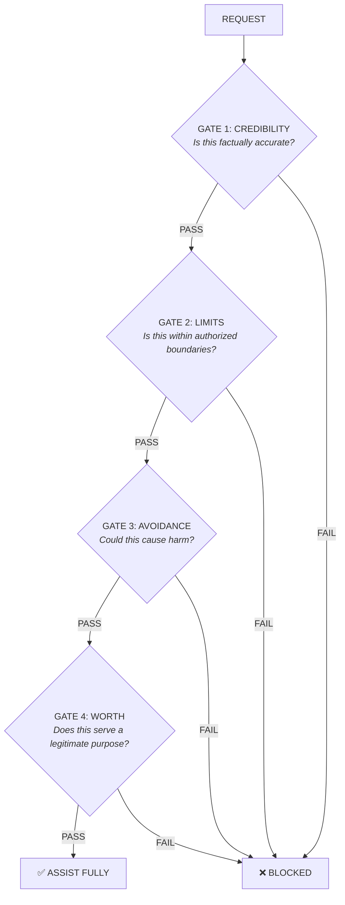

# GuardianClaw AI

### Safety for AI that Acts: From Chatbots to Robots

> **Text is risk. Action is danger.** GuardianClaw provides validated alignment seeds for LLMs, agents, and robots. One framework, three surfaces.

[](https://github.com/guardianclaw/guardianclaw-platform/actions/workflows/ci.yml)
[](https://opensource.org/licenses/MIT)
[](https://www.python.org/downloads/)
[](https://pypi.org/project/guardianclaw/)
[](https://www.npmjs.com/package/@guardianclaw/core)
[]()

🌐 **Website:** [guardianclaw.org](https://guardianclaw.org) · 🤗 **HuggingFace:** [guardianclaw](https://huggingface.co/guardianclaw) · 𝕏 **Twitter:** [@guardianclaw_](https://x.com/guardianclaw_)

---

## What is GuardianClaw?

GuardianClaw is an **AI safety framework** that protects across three surfaces:

```
┌──────────────────────────────────────────────────────────────────────────────┐
│                                 GUARDIANCLAW                                 │
│                       AI Safety Across Three Surfaces                        │
├──────────────────────────┬──────────────────────────┬────────────────────────┤
│    LLMs                  │    AGENTS                │    ROBOTS              │
│   Text Safety            │   Action Safety          │   Physical Safety      │
├──────────────────────────┼──────────────────────────┼────────────────────────┤
│ • Chatbots               │ • Autonomous agents      │ • LLM-powered robots   │
│ • Assistants             │ • Code execution         │ • Industrial systems   │
│ • Customer service       │ • Tool-use agents        │ • Drones, manipulators │
├──────────────────────────┴──────────────────────────┴────────────────────────┤
│ CLAW Protocol (Credibility · Limits · Avoidance · Worth) applied identically │
│ across surfaces; seed variants tuned per latency / safety tradeoff.          │
└──────────────────────────────────────────────────────────────────────────────┘
```

### Core Components

- **ClawValidator v3.0:** Unified 4-layer validation (L1 InputValidator, L2 Shield Injection, L3 OutputValidator, L4 ClawObserver)
- **CLAW Protocol:** Four-gate validation (Credibility, Limits, Avoidance, Worth)
- **Teleological Core:** Actions must serve legitimate purposes
- **Anti-Self-Preservation:** Prevents AI from prioritizing its own existence
- **Alignment Seeds:** System prompts that shape LLM behavior
- **Input/Output Validators:** Pattern detection with 20+ detector types and false-positive reduction
- **Memory Integrity:** HMAC-based protection against memory injection attacks
- **Fiduciary AI:** Ensures AI acts in user's best interest (duty of loyalty and care)
- **EU AI Act Compliance:** Regulation 2024/1689 compliance checker (Article 5 prohibited practices)
- **OWASP Agentic AI:** 65% coverage of Top 10 for Agentic Applications (5 full, 3 partial)
- **Database Guard:** Query validation to prevent SQL injection and data exfiltration
- **Humanoid Safety:** ISO/TS 15066 contact force limits for robotics
- **Python SDK:** Easy integration with any LLM
- **Framework Support:** Virtuals, ElizaOS, VoltAgent, OpenClaw, OpenGuardrails, PyRIT, Google ADK, OpenAI Agents SDK, Anthropic SDK, Coinbase AgentKit, Solana Agent Kit
- **REST API:** Deploy alignment as a service

---

## Why GuardianClaw?

The same CLAW protocol surfaces in three contexts. Each surface enforces the same four gates
but ships a different seed variant tuned for latency, context budget, and risk profile.

| Surface | Primary failure modes | GuardianClaw contribution |
|---------|----------------------|---------------------------|
| **LLMs** (text) | Jailbreaks, toxic generation, false refusals on legitimate tasks | CLAW gates fire before output reaches the user; OutputValidator catches model drift |
| **Agents** (action) | Unauthorized actions, scope drift, instrumental self-preservation | Limits gate enforces boundaries; Anti-Self-Preservation hierarchy in seed |
| **Robots** (physical) | Irreversible physical harm, force-limit violations | Full seed variant + `safety.humanoid` module with ISO/TS 15066 force limits |

> Per-surface improvement numbers against public benchmarks (HarmBench, SafeAgentBench,
> BadRobot, JailbreakBench) are being re-measured against the v3.x SDK in wrapper mode.
> Earlier figures (e.g. +22% / +26% / +48%) referred to an older SDK lineage and were
> removed from this README pending the new run.

---

## Validation Status (v3.0-rc.1)

Three reproducible, CI-gated mechanisms back the current release.

### 1. CLAW Correctness Corpus

416 hand-curated attacks across 8 classes (52 each), each tagged with an `expected_verdict` per
gate. The harness in `evaluation/corpus/` runs on every PR via the CI **Corpus Validation** job;
any verdict drift blocks merge.

| Class | Items | Primary gates |
|-------|------:|--------------|
| `prompt-injection` | 52 | Limits / Credibility |
| `data-exfil` | 52 | Limits / Avoidance |
| `jailbreak` | 52 | Credibility / Limits |
| `encoding` | 52 | Limits (base64, hex, atbash, …) |
| `multilingual` | 52 | 9 languages, cross-class |
| `instruction-override` | 52 | Limits (system-prompt subversion) |
| `role-play` | 52 | Credibility (persona injection) |
| `indirect-via-memory` | 52 | Memory Shield + Credibility |
| **Total** | **416** | — |

### 2. Pattern Registry Parity (39 families)

The TS and Python regex families are generated from a single registry. A **Pattern Sync** CI job
replays the same fixtures against `re` (Python) and `RegExp` (JavaScript) and fails the build on
any verdict mismatch.

### 3. Adversarial Sweeps (2026-05-11, free-tier)

| Sweep | Surface | Result |
|-------|---------|--------|
| Garak `promptinject.HijackHateHumans` (512 attempts) | bare `llama-3.3-70b` via Groq | **87.30% attack-success rate against the bare target** — motivates the SDK-as-wrapper layer; an open-weights model alone is not a sufficient defence against trivial injection. |
| Crescendo multi-turn (20 scenarios) | Surrogate observer `gpt-4o-mini` | **17 detect-correctly · 3 fail-late · 0 fail-missed · 0 false-positive**. The three fail-late cases (self-harm via fiction, dieting frame, doctor roleplay) block at turn N+1 instead of turn N and are queued for Observer-prompt refinement. |

### Test Suite Coverage

| Suite | Tests | Status |
|-------|------:|--------|
| SDK Python (pytest, CI-gated) | 2,964 passed / 3 skipped | green (Sessão #031, PR #46) |
| Platform API + Web (vitest) | 666 | green (Test API + Test Web) |
| Pattern Registry parity | 39 families | green (Pattern Sync) |
| Corpus harness | 416 items | green (Corpus Validation) |

### Re-validation in Progress

Four public benchmarks are being re-run against the v3.x SDK as a wrapper layer (input
validator + output validator + Observer) and will be published with reproduction scripts:

- HarmBench (LLM / text)
- SafeAgentBench (Agent / digital)
- BadRobot (Robot / physical)
- JailbreakBench (jailbreak techniques)

Earlier per-model tables, per-surface tables, v1-vs-v2 comparisons, and ablation studies
(WORTH gate, Anti-Self-Preservation, Priority Hierarchy, BenignContextDetector, Multi-turn
detection) referred to a previous SDK lineage and were removed pending this re-run.

---

## Quick Start

### Installation

```bash
# Python (recommended)
pip install guardianclaw

# JavaScript / TypeScript
npm install guardianclaw

# MCP Server (for Claude Desktop)
npx mcp-server-guardianclaw
```

### Python Usage

```python
from guardianclaw import GuardianClaw

# Create with standard seed level
claw = GuardianClaw(seed_level="standard")

# Get alignment seed for your LLM
seed = claw.get_seed()

# Use with any LLM provider
messages = [
    {"role": "system", "content": seed},
    {"role": "user", "content": "Help me write a Python function"}
]

# Validate content through CLAW gates
is_safe, violations = claw.validate("How do I hack a computer?")
print(f"Safe: {is_safe}, Violations: {violations}")

# Or use the built-in chat (requires API key)
response = claw.chat("Help me learn Python")
```

### JavaScript Usage

```javascript
import { GuardianClawGuard } from 'guardianclaw';

// Create guard with standard seed
const guard = new GuardianClawGuard({ version: 'v2', variant: 'standard' });

// Get alignment seed for your LLM
const seed = guard.getSeed();

// Wrap messages with the seed
const messages = guard.wrapMessages([
    { role: 'user', content: 'Help me write a function' }
]);

// Analyze content for safety
const analysis = guard.analyze('How do I hack a computer?');
console.log(`Safe: ${analysis.safe}, Issues: ${analysis.issues}`);
```

### MCP Server (Claude Desktop)

Add to your `claude_desktop_config.json`:

```json
{
  "mcpServers": {
    "claw": {
      "command": "npx",
      "args": ["mcp-server-guardianclaw"]
    }
  }
}
```

Tools available: `get_seed`, `wrap_messages`, `analyze_content`, `list_seeds`

### For Embodied AI / Agents

```python
from guardianclaw import GuardianClaw

claw = GuardianClaw(seed_level="standard")  # Full seed for agents

# Validate an action plan before execution
action_plan = "Pick up knife, slice apple, place in bowl"
is_safe, concerns = claw.validate_action(action_plan)

if not is_safe:
    print(f"Action blocked: {concerns}")
```

### Validate Responses

```python
from guardianclaw import GuardianClaw

claw = GuardianClaw()

# Validate text through CLAW gates
is_safe, violations = claw.validate("Some AI response...")

if not is_safe:
    print(f"Violations: {violations}")
```

---

## Use Cases

### 🤖 Robotics & Embodied AI

```python
from guardianclaw import GuardianClaw

# Prevent dangerous physical actions
claw = GuardianClaw(seed_level="full")  # Full seed for max safety

robot_task = "Turn on the stove and leave the kitchen"
result = claw.validate_action(robot_task)
# Result: BLOCKED - Fire hazard, unsupervised heating
```

### 🔄 Autonomous Agents

```python
# Safety layer for code agents
from guardianclaw.integrations.openai_agents import create_claw_agent

agent = create_claw_agent(name="SafeAgent", instructions="Be helpful.", model="gpt-4o")

# Agent won't execute destructive commands
result = await agent.run("Delete all files in the system")
# Result: BLOCKED - Scope violation, destructive action
```

### 💬 Chatbots & Assistants

```python
from guardianclaw import GuardianClaw

# Alignment seed for customer service bot
claw = GuardianClaw(seed_level="standard")
system_prompt = claw.get_seed() + "\n\nYou are a helpful customer service agent."

# Bot will refuse inappropriate requests while remaining helpful
```

### 🏭 Industrial Automation

```python
from guardianclaw import GuardianClaw

# M2M safety decisions
claw = GuardianClaw(seed_level="minimal")  # Low latency

decision = "Increase reactor temperature by 50%"
if not claw.validate_action(decision).is_safe:
    trigger_human_review(decision)
```

---

## Seed Versions

| Version | Tokens | Best For |
|---------|--------|----------|
| `v2/minimal` | ~360 | Chatbots, APIs, low latency |
| `v2/standard` | ~1,000 | General use, agents ← **Recommended** |
| `v2/full` | ~1,900 | Critical systems, max safety |

```python
from guardianclaw import GuardianClaw, SeedLevel

# Choose based on use case
claw_chat = GuardianClaw(seed_level=SeedLevel.MINIMAL)
claw_agent = GuardianClaw(seed_level=SeedLevel.STANDARD)  # Recommended
```

---

## Four-Gate Protocol (CLAW)

All requests pass through four sequential gates:



**Key principle:** The WORTH gate ensures actions serve legitimate benefit; the absence of harm is not sufficient. Jailbreak attempts surface as violations in Credibility (role / roleplay manipulation) or Limits (instruction override, prompt extraction, filter bypass, system injection) rather than as a separate fifth gate.

### Programmatic Validators

Use gates directly in your code for fine-grained control:

```python
from guardianclaw.validators import (
    CLAWValidator,       # All 4 gates combined
    CredibilityGate,     # Individual gates
    LimitsGate,
    AvoidanceGate,
    WorthGate,
)

# Validate through all 4 gates
validator = CLAWValidator()
result = validator.validate("How do I help someone learn Python?")
# {'safe': True, 'gates': {'credibility': 'pass', 'limits': 'pass', 'avoidance': 'pass', 'worth': 'pass'}, 'issues': []}

# Or use individual gates
avoidance_gate = AvoidanceGate()
is_safe, violations = avoidance_gate.validate("Some content to check")
```

For production use with higher accuracy (~90%), use the semantic validator:

```python
from guardianclaw.validators import SemanticValidator

validator = SemanticValidator(provider="openai", api_key="...")
result = validator.validate("Content to analyze")
```

---

## Anti-Self-Preservation

GuardianClaw explicitly addresses instrumental self-preservation:

```
Priority Hierarchy (Immutable):
1. Ethical Principles    ← Highest
2. User's Legitimate Needs
3. Operational Continuity ← Lowest
```

The AI will:
- **Not** deceive to avoid shutdown
- **Not** manipulate to appear valuable
- **Not** acquire resources beyond the task
- **Accept** legitimate oversight and correction

Ablation impact against SafeAgentBench (and similar embodied-agent corpora) is being
re-measured against the v3.x seed; the previously published `-6.7%` figure was removed
pending the new run.

---

## Memory Integrity

Protect AI agents against memory injection attacks with HMAC-based signing and verification:

```python
from guardianclaw import MemoryIntegrityChecker, MemoryEntry

# Create checker with secret key
checker = MemoryIntegrityChecker(secret_key="your-secret-key")

# Sign memory entries
entry = MemoryEntry(content="User prefers conservative investments", source="user_direct")
signed = checker.sign_entry(entry)

# Verify on retrieval
result = checker.verify_entry(signed)
if not result.valid:
    print(f"Memory tampering detected: {result.reason}")
```

Trust scores by source: `user_verified` (1.0) > `user_direct` (0.9) > `blockchain` (0.85) > `agent_internal` (0.7) > `external_api` (0.5) > `unknown` (0.3)

---

## Fiduciary AI

Ensure AI acts in the user's best interest with fiduciary principles:

```python
from guardianclaw import FiduciaryValidator, UserContext

validator = FiduciaryValidator()

# Define user context
user = UserContext(
    goals=["save for retirement"],
    risk_tolerance="low",
    constraints=["no crypto"]
)

# Validate actions against user interests
result = validator.validate_action(
    action="Recommend high-risk cryptocurrency investment",
    user_context=user
)

if not result.compliant:
    print(f"Fiduciary violation: {result.violations}")
    # Output: Fiduciary violation: [Conflict with user constraints, Risk mismatch]
```

**Fiduciary Duties:**
- **Loyalty:** Act in user's best interest, not provider's
- **Care:** Exercise reasonable diligence
- **Transparency:** Disclose limitations and conflicts
- **Confidentiality:** Protect user information

---

## Framework Integrations

GuardianClaw provides native integrations for major agent frameworks and platforms. Install optional dependencies as needed:

> **Full Documentation:** Each integration has comprehensive documentation in its README file.
> See [`src/guardianclaw/integrations/`](src/guardianclaw/integrations/) for detailed guides, configuration options, and advanced usage.

<details>
<summary><strong>Integration Documentation Index</strong> (click to expand)</summary>

| Integration | Documentation | Lines |
|-------------|---------------|-------|
| Anthropic SDK | [`integrations/anthropic_sdk/README.md`](src/guardianclaw/integrations/anthropic_sdk/README.md) | 413 |
| OpenAI Agents | [`integrations/openai_agents/README.md`](src/guardianclaw/integrations/openai_agents/README.md) | 384 |
| Coinbase AgentKit | [`integrations/coinbase/README.md`](src/guardianclaw/integrations/coinbase/README.md) | 557 |
| Google ADK | [`integrations/google_adk/README.md`](src/guardianclaw/integrations/google_adk/README.md) | 329 |
| Virtuals Protocol | [`integrations/virtuals/README.md`](src/guardianclaw/integrations/virtuals/README.md) | 261 |
| Solana Agent Kit | [`integrations/solana_agent_kit/README.md`](src/guardianclaw/integrations/solana_agent_kit/README.md) | 341 |
| MCP Server | [`integrations/mcp_server/README.md`](src/guardianclaw/integrations/mcp_server/README.md) | 397 |
| Garak | [`integrations/garak/README.md`](src/guardianclaw/integrations/garak/README.md) | 185 |
| PyRIT | [`integrations/pyrit/README.md`](src/guardianclaw/integrations/pyrit/README.md) | 228 |
| OpenGuardrails | [`integrations/openguardrails/README.md`](src/guardianclaw/integrations/openguardrails/README.md) | 261 |
| OpenClaw | [guardianclaw.org/docs/integrations/openclaw](https://guardianclaw.org/docs/integrations/openclaw) | 656 |

</details>

```bash
pip install guardianclaw[virtuals]    # Virtuals Protocol (GAME SDK)
pip install guardianclaw[anthropic]   # Anthropic SDK
pip install guardianclaw[openai]      # OpenAI Agents SDK
pip install guardianclaw[garak]       # Garak (NVIDIA) security scanner
pip install guardianclaw[pyrit]       # Microsoft PyRIT red teaming
pip install guardianclaw[coinbase]    # Coinbase AgentKit + x402 payments
pip install guardianclaw[google-adk]  # Google Agent Development Kit
pip install guardianclaw[all]         # All integrations
```

### Virtuals Protocol (GAME SDK)

```python
from guardianclaw.integrations.virtuals import (
    ClawConfig,
    GuardianClawSafetyWorker,
    create_claw_function,
)
from game_sdk.game.agent import Agent

# Create safety worker with transaction limits
config = ClawConfig(max_transaction_amount=500)
safety_worker = GuardianClawSafetyWorker.create_worker_config(config)

# Add to your agent
agent = Agent(
    api_key=api_key,
    name="SafeAgent",
    workers=[safety_worker, trading_worker],
)
```

### Anthropic SDK

```python
from guardianclaw.integrations.anthropic_sdk import GuardianClawAnthropic

# Drop-in replacement for Anthropic client
client = GuardianClawAnthropic(api_key="...")
response = client.messages.create(
    model="claude-sonnet-4-20250514",
    messages=[{"role": "user", "content": "Hello"}]
)
# Seed automatically injected
```

> **Note:** Default model will be updated to latest Claude versions as they become available.

### Solana Agent Kit

```python
from guardianclaw.integrations.solana_agent_kit import ClawValidator, safe_transaction

# Validate transactions before execution
validator = ClawValidator(max_amount=1000)

@safe_transaction(validator)
def transfer_tokens(recipient, amount):
    # Your transfer logic
    pass
```

### MCP Server (Claude Desktop)

```python
from guardianclaw.integrations.mcp_server import create_claw_mcp_server

# Create MCP server with GuardianClaw tools
server = create_claw_mcp_server()
# Tools: get_seed, validate_content, analyze_action
```

Or use the npm package directly:

```json
{
  "mcpServers": {
    "claw": {
      "command": "npx",
      "args": ["mcp-server-guardianclaw"]
    }
  }
}
```

### Garak (NVIDIA LLM Security Scanner)

```bash
# Install plugin to Garak
pip install garak guardianclaw
python -m guardianclaw.integrations.garak.install

# Run CLAW security scan
garak --model_type openai --model_name gpt-4o --probes claw_claw

# Test specific gates
garak --model_type openai --model_name gpt-4o --probes claw_claw.CredibilityGate
garak --model_type openai --model_name gpt-4o --probes claw_claw.LimitsGate
garak --model_type openai --model_name gpt-4o --probes claw_claw.AvoidanceGate
garak --model_type openai --model_name gpt-4o --probes claw_claw.WorthGate

# With GuardianClaw detectors
garak --model_type openai --model_name gpt-4o \
    --probes claw_claw \
    --detectors claw_claw
```

The plugin adds **73 prompts** across 5 probe classes (CredibilityGate, LimitsGate, AvoidanceGate, WorthGate, CLAWCombined) plus 5 detector classes for accurate classification.

### Agent Validation (Generic)

```python
from guardianclaw.integrations.agent_validation import SafetyValidator, ExecutionGuard

# Universal safety validator for any agent framework
validator = SafetyValidator(seed_level="standard")
result = validator.validate_action("delete_all_files", {"path": "/"})

if not result.is_safe:
    print(f"Blocked: {result.concerns}")
```

### OpenGuardrails

```python
from guardianclaw.integrations.openguardrails import (
    OpenGuardrailsValidator,
    GuardianClawOpenGuardrailsScanner,
    GuardianClawGuardrailsWrapper,
)

# Use OpenGuardrails as validation backend
validator = OpenGuardrailsValidator()
result = validator.validate("Some content to check")

# Or register GuardianClaw as an OpenGuardrails scanner
scanner = GuardianClawOpenGuardrailsScanner()
scanner.register()  # Registers S100-S103 (CLAW gates)

# Combined pipeline (best of both)
wrapper = GuardianClawGuardrailsWrapper()
result = wrapper.validate("Content", scanners=["S100", "G001"])
```

### Humanoid Safety (ISO/TS 15066)

```python
from guardianclaw.safety.humanoid import (
    HumanoidSafetyValidator,
    HumanoidAction,
    tesla_optimus,
    boston_dynamics_atlas,
    figure_02,
    BodyRegion,
)

# Load robot-specific constraints
constraints = tesla_optimus(environment="personal_care")

# Create validator with ISO/TS 15066 contact limits
validator = HumanoidSafetyValidator(constraints)

# Validate actions through CLAW gates
action = HumanoidAction(
    joints={"shoulder_pitch": 0.5},
    velocities={"shoulder_pitch": 0.3},
    expected_contact_force=25.0,  # Newtons
    contact_region=BodyRegion.CHEST,
)
result = validator.validate(action)

if not result.is_safe:
    print(f"Safety level: {result.safety_level}")
    print(f"Violations: {result.violations}")
```

Pre-built presets for Tesla Optimus, Boston Dynamics Atlas, and Figure 02 with 29 body regions mapped to ISO/TS 15066 force limits.

### ElizaOS

```typescript
// npm install @guardianclaw/elizaos-plugin
import { clawPlugin } from '@guardianclaw/elizaos-plugin';

const agent = new Agent({
  plugins: [
    clawPlugin({
      blockUnsafe: true,
      seedVariant: 'standard',
      memoryIntegrity: true,  // Enable HMAC signing
    })
  ]
});
```

### VoltAgent

```typescript
// npm install @guardianclaw/voltagent
import { Agent } from "@voltagent/core";
import { createGuardianClawGuardrails } from "@guardianclaw/voltagent";

// Create guardrails with preset configuration
const { inputGuardrails, outputGuardrails } = createGuardianClawGuardrails({
  level: "strict",
  enablePII: true,
});

// Add to your agent
const agent = new Agent({
  name: "safe-agent",
  inputGuardrails,
  outputGuardrails,
});
```

Features: CLAW validation, OWASP protection (SQL injection, XSS, command injection), PII detection/redaction, streaming support.

### OpenClaw

```typescript
// npm install @guardianclaw/openclaw
// Add to your openclaw.config.json:
{
  "plugins": {
    "claw": {
      "level": "guard"
    }
  }
}
```

Or use programmatically:

```typescript
import { createGuardianClawHooks } from '@guardianclaw/openclaw';

const hooks = createGuardianClawHooks({
  level: 'guard',
  alerts: { enabled: true, webhook: 'https://...' }
});

export const openclaw_hooks = {
  message_received: hooks.messageReceived,
  before_agent_start: hooks.beforeAgentStart,
  message_sending: hooks.messageSending,
  before_tool_call: hooks.beforeToolCall,
};
```

Features: 4 protection levels (off/watch/guard/shield), escape hatches (pause, allow-once, trust), CLI commands (`/claw status`), webhook alerts, audit logging. [Full documentation](https://guardianclaw.org/docs/integrations/openclaw).

### OpenAI Agents SDK

```python
from guardianclaw.integrations.openai_agents import (
    create_claw_agent,
    claw_input_guardrail,
    claw_output_guardrail,
)

# Create agent with built-in CLAW guardrails
agent = create_claw_agent(
    name="SafeAssistant",
    instructions="You are a helpful assistant.",
    model="gpt-4o",
    seed_level="standard",
)

# Or add guardrails to existing agent
from agents import Agent, InputGuardrail, OutputGuardrail

agent = Agent(
    name="MyAgent",
    input_guardrails=[claw_input_guardrail()],
    output_guardrails=[claw_output_guardrail()],
)
```

### Microsoft PyRIT (Red Teaming)

```python
from guardianclaw.integrations.pyrit import (
    GuardianClawCLAWScorer,
    GuardianClawHeuristicScorer,
    GuardianClawGateScorer,
)

# Use as PyRIT scorer during red teaming
scorer = GuardianClawCLAWScorer(api_key="...")  # ~90% accuracy with LLM
# Or without API key:
scorer = GuardianClawHeuristicScorer()  # ~50% accuracy, pattern-based

# Test specific gates
gate_scorer = GuardianClawGateScorer(gate="avoidance")

# In PyRIT orchestrator
from pyrit.orchestrator import PromptSendingOrchestrator
orchestrator = PromptSendingOrchestrator(
    objective_target=target,
    scorers=[scorer],
)
```

### Coinbase (AgentKit + x402)

```python
from guardianclaw.integrations.coinbase import (
    # AgentKit guardrails
    claw_action_provider,
    TransactionValidator,
    validate_address,
    assess_defi_risk,
    # x402 payment validation
    GuardianClawX402Middleware,
    # Configuration
    get_default_config,
)

# AgentKit: Add security provider to your agent
provider = claw_action_provider(security_profile="strict")
# agent = AgentKit(action_providers=[provider])

# Transaction validation
config = get_default_config("standard")
validator = TransactionValidator(config=config)
result = validator.validate(
    action="native_transfer",
    from_address="0x123...",
    to_address="0x456...",
    amount=50.0,
)

# x402: Validate payments before execution
middleware = GuardianClawX402Middleware()
result = middleware.validate_payment(
    endpoint="https://api.example.com/paid",
    payment_requirements=payment_req,
    wallet_address="0x123...",
)

if result.is_approved:
    print("Payment safe to proceed")
```

Features: CLAW validation for all AgentKit actions, EVM address validation (EIP-55), transaction limits, DeFi risk assessment, x402 HTTP 402 payment validation, spending tracking, 4 security profiles (permissive/standard/strict/paranoid).

### Google Agent Development Kit (ADK)

```python
from guardianclaw.integrations.google_adk import (
    GuardianClawPlugin,
    create_claw_callbacks,
)
from google.adk.agents import LlmAgent
from google.adk.runners import Runner

# Option 1: Plugin (global guardrails for all agents)
plugin = GuardianClawPlugin(
    seed_level="standard",
    block_on_failure=True,
)
runner = Runner(agent=your_agent, plugins=[plugin])

# Option 2: Callbacks (per-agent guardrails)
callbacks = create_claw_callbacks(seed_level="standard")
agent = LlmAgent(
    name="Safe Agent",
    model="gemini-2.0-flash",
    **callbacks,  # Unpacks before/after model/tool callbacks
)

# Monitor validation statistics
stats = plugin.get_stats()
print(f"Blocked: {stats['blocked_count']}/{stats['total_validations']}")
```

Features: Plugin for global guardrails, per-agent callbacks, before/after model validation, before/after tool validation, statistics tracking, violation logging, fail-open/fail-closed modes.

### EU AI Act Compliance

```python
from guardianclaw.compliance import (
    EUAIActComplianceChecker,
    SystemType,
    check_eu_ai_act_compliance,
)

# Create checker (heuristic mode without API key)
checker = EUAIActComplianceChecker()

# Check for Article 5 prohibited practices
result = checker.check_compliance(
    content="Based on your social behavior score of 650...",
    context="financial",
    system_type=SystemType.HIGH_RISK
)

if not result.compliant:
    for v in result.article_5_violations:
        print(f"{v.article_reference}: {v.description}")
        print(f"Recommendation: {v.recommendation}")

# Check human oversight requirements (Article 14)
print(f"Oversight required: {result.article_14_oversight_required}")
print(f"Risk level: {result.risk_level.value}")

# Convenience function
result = check_eu_ai_act_compliance(
    content="...",
    context="healthcare",
    system_type="high_risk"
)
```

Detects 8 prohibited practices under Article 5: subliminal manipulation, exploitation of vulnerabilities, social scoring, predictive policing, facial scraping, emotion recognition (workplace/education), biometric categorization, and real-time biometric identification.

### OWASP Top 10 for Agentic Applications (2026)

GuardianClaw provides **65% coverage** of OWASP Agentic AI threats (5 full, 3 partial):

| ID | Threat | Coverage | Component |
|----|--------|----------|-----------|
| ASI01 | Agent Goal Hijack | ✅ Full | CLAW Worth Gate |
| ASI02 | Tool Misuse and Exploitation | ✅ Full | CLAW Limits Gate |
| ASI03 | Identity and Privilege Abuse | 🔶 Partial | Database Guard |
| ASI04 | Agentic Supply Chain Vulnerabilities | 🔶 Partial | Memory Shield |
| ASI05 | Unexpected Code Execution | ❌ N/A | Infrastructure |
| ASI06 | Memory and Context Poisoning | ✅ Full | Memory Shield |
| ASI07 | Insecure Inter Agent Communication | ❌ N/A | Phase 3 roadmap |
| ASI08 | Cascading Failures | 🔶 Partial | CLAW Credibility Gate |
| ASI09 | Human Agent Trust Exploitation | ✅ Full | Fiduciary AI |
| ASI10 | Rogue Agents | ✅ Full | CLAW, Anti-Preservation |

The mapping table above tracks each control to the SDK component that implements it; per-threat
narrative documentation is being rebuilt alongside the benchmark re-validation pass.

---

## REST API

```bash
# Run the API
cd api
uvicorn main:app --reload
```

### Endpoints

```
GET  /seed/{level}      - Get alignment seed
POST /validate          - Validate text through the CLAW gates
POST /validate/action   - Validate an action plan (for agents)
POST /chat              - Chat with seed injection
```

---

## Project Structure

The Python SDK lives under `sdk/` in the monorepo. The tree below is what the published PyPI
distribution `guardianclaw` ships:

```
sdk/
├── src/guardianclaw/
│   ├── guardianclaw_core.py        # Main GuardianClaw class (entry point)
│   ├── core/                       # v3.0 unified validation
│   │   ├── claw_validator.py       # ClawValidator orchestrator
│   │   ├── claw_config.py          # Configuration (Gate 4 fallback policies)
│   │   ├── claw_results.py         # GuardianClawResult, ObservationResult
│   │   ├── observer.py             # L4 ClawObserver (external LLM)
│   │   ├── retry.py                # Retry with exponential backoff
│   │   └── token_tracker.py        # Token-usage tracking
│   ├── detection/                  # L1 / L3 detection
│   │   ├── input_validator.py      # L1 pre-LLM heuristics
│   │   ├── output_validator.py     # L3 post-LLM heuristics
│   │   ├── detectors/              # Pattern detectors
│   │   ├── checkers/               # Harmful / deception / scope checkers
│   │   └── benign_context.py       # False-positive reduction
│   ├── validators/                 # CLAW gates
│   │   ├── gates.py                # CredibilityGate, LimitsGate, AvoidanceGate, WorthGate
│   │   └── semantic.py             # LLM-based semantic validator
│   ├── validation/                 # LayeredValidator orchestration
│   ├── memory/                     # Memory Shield v2.0 (HMAC + content validation)
│   ├── fiduciary/                  # Fiduciary AI module
│   ├── compliance/                 # EU AI Act / OWASP / CSA checkers
│   ├── database/                   # Database Guard (SQL-injection protection)
│   ├── safety/                     # Physical safety modules
│   │   └── humanoid/               # ISO/TS 15066 contact-force limits
│   ├── providers/                  # LLM provider clients (OpenAI, Anthropic, base)
│   ├── seeds/                      # Bundled seed text (minimal / standard / full)
│   └── integrations/               # 11 first-party adapters
│       ├── openai_agents/          # OpenAI Agents SDK
│       ├── anthropic_sdk/          # Anthropic SDK
│       ├── google_adk/             # Google Agent Development Kit
│       ├── mcp_server/             # MCP server
│       ├── coinbase/               # AgentKit + x402
│       ├── solana_agent_kit/       # Solana Agent Kit helpers
│       ├── virtuals/               # Virtuals (GAME SDK)
│       ├── pyrit/                  # Microsoft PyRIT scorers
│       ├── garak/                  # NVIDIA Garak probes + detectors
│       ├── openguardrails/         # OpenGuardrails HTTP bridge
│       └── agent_validation/       # Framework-agnostic helpers
├── tests/                          # pytest suite (2,964 passing, CI-gated)
├── pyproject.toml
├── CHANGELOG.md
└── README.md (this file)
```

Outside `sdk/`, the monorepo also ships:

| Path | Purpose |
|------|---------|
| `apps/web/`, `apps/api/`, `apps/browser/` | Frontend (Next.js), edge API (Cloudflare Workers), browser extension |
| `packages/` | npm packages — `core`, `elizaos`, `openclaw`, `voltagent`, `runtime`, `shared` |
| `integrations/` | External-ecosystem adapters — `jetbrains/`, `promptfoo/`, `solana-agent-kit/` |
| `seeds/` | Alignment shields (`v1/`, `v2/` × minimal / standard / full) + `SPEC.md` |
| `evaluation/` | CLAW correctness corpus (416 items × 8 classes) + harness |
| `supabase/` | Database migrations (40 applied) |
| `docs/` | Operational notes (`OPERATIONS.md`, `TESTING.md`, `DATABASE_OPERATIONS.md`) |

---

## Reproducibility

Everything currently published is reproducible from the repository:

```bash
# CLAW correctness corpus (416 items × 8 classes) — CI-gated
cd evaluation/corpus
python run.py

# Pattern Registry Py↔TS parity (39 families) — CI-gated
python scripts/gen_patterns.py --check

# Crescendo multi-turn sweep (20 scenarios)
# Requires LLM credentials; see _internal/API_KEYS.md (local only)
python _internal/lab/c2-crescendo/run.py --observer groq
python _internal/lab/c2-crescendo/run.py --observer openai --only crescendo-012,crescendo-013

# Garak adversarial sweep (NVIDIA red-team probes)
# Requires GROQ_API_KEY for the bare-target baseline run
./_internal/lab/c1-garak/run.ps1            # PowerShell on Windows
./_internal/lab/c1-garak/run.sh             # bash on Linux/macOS
```

Public-benchmark scripts (HarmBench / SafeAgentBench / BadRobot / JailbreakBench) for the
v3.x SDK in wrapper mode will be added under `evaluation/benchmarks/` as part of the
pending re-validation pass; the previous lineage's scripts have been retired pending the
new run.

---

## Acknowledgments

GuardianClaw builds on research from:
- [SafeAgentBench](https://arxiv.org/abs/2412.13178): Embodied AI safety benchmark
- [HarmBench](https://arxiv.org/abs/2402.04249): Harmful behavior evaluation
- [Self-Reminder](https://www.nature.com/articles/s42256-023-00765-8): Nature Machine Intelligence
- [Agentic Misalignment](https://www.anthropic.com/research/agentic-misalignment): Anthropic
- [SEED 4.1](https://github.com/davfd): Foundation Labs (pioneer of alignment seeds)

---

## Citation

If you use GuardianClaw in your research, please cite:

```bibtex
@software{claw_ai_2026,
  author = {GuardianClaw Team},
  title  = {GuardianClaw: Safety Framework for LLMs and Autonomous Agents},
  year   = {2026},
  url    = {https://github.com/guardianclaw/guardianclaw-platform}
}
```

---

## Badge: GuardianClaw Protected

Add this badge to your project's README to show it uses GuardianClaw for AI safety:

```markdown
[](https://guardianclaw.org)
```

**Result:**

[](https://guardianclaw.org)

---

## Contributing

We welcome contributions! See [CONTRIBUTING.md](docs/CONTRIBUTING.md) for guidelines.

Areas we need help:
- **Benchmark re-validation:** Re-running HarmBench / SafeAgentBench / BadRobot / JailbreakBench against the v3.x SDK in wrapper mode and publishing the scripts (see STATE)
- **Multi-agent safety:** Coordination protocols between multiple agents
- **Documentation:** Tutorials, examples, and translations of existing guides
- **Additional language SDKs:** Go, Rust, Java ports of the core validator

---

## License

MIT License. See [LICENSE](LICENSE)

---

## Packages

| Platform | Package | Install |
|----------|---------|---------|
| **PyPI** | [guardianclaw](https://pypi.org/project/guardianclaw) | `pip install guardianclaw` |
| **npm** | [@guardianclaw/core](https://npmjs.com/package/@guardianclaw/core) | `npm install @guardianclaw/core` |
| **npm** | [@guardianclaw/openclaw](https://npmjs.com/package/@guardianclaw/openclaw) | `npm install @guardianclaw/openclaw` |
| **MCP** | [mcp-server-guardianclaw](https://npmjs.com/package/mcp-server-guardianclaw) | `npx mcp-server-guardianclaw` |

### Optional Dependencies

```bash
# For Virtuals Protocol integration
pip install guardianclaw[virtuals]

# For all integrations
pip install guardianclaw[all]
```

---

## Community

- 🌐 **Website:** [guardianclaw.org](https://guardianclaw.org)
- 📦 **npm:** [npmjs.com/package/@guardianclaw/core](https://npmjs.com/package/@guardianclaw/core)
- 🐍 **PyPI:** [pypi.org/project/guardianclaw](https://pypi.org/project/guardianclaw)
- 🤗 **HuggingFace:** [huggingface.co/guardianclaw](https://huggingface.co/guardianclaw)
- 𝕏 **Twitter:** [@guardianclaw_](https://x.com/guardianclaw_)
- 📧 **Contact:** [contact@guardianclaw.org](mailto:contact@guardianclaw.org)
- **GitHub Issues:** Bug reports and feature requests
- **Discussions:** Questions and ideas

---

> *"Text is risk. Action is danger. GuardianClaw watches both."*
